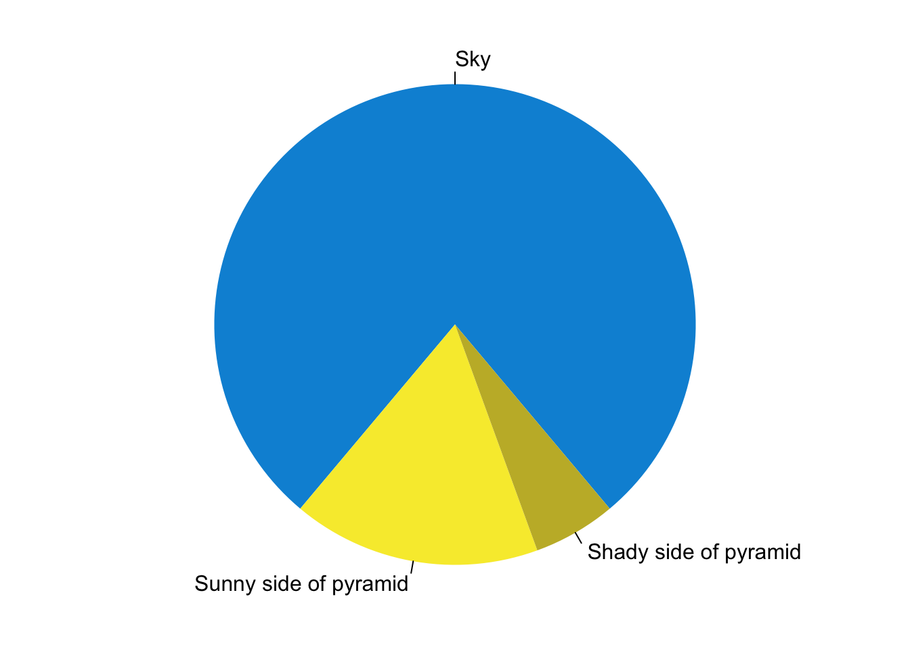

Feature B
=========

*Emphasized text* and **bold text**

Level 1
=======

Level 2
-------

Level 3
^^^^^^^

Level 4
"""""""

`A link <http://chenghanyustats.github.io>`_

1. item 1
2. item 2
#. item 3 Numbered lists (can be automatic using #)
#. item 4

====== ======
No.    Prime
====== ======
1      No
2      Yes
3      Yes
4      No
====== ======

The following is a code block::

  def hello():
      print("Hello world")

.. code-block:: 

   def hello():
      print("Hello world")

And here shows some C code 

.. code-block:: 

   #include <stdio.h>
   int main()
   {
       printf("Hello, World!");
       return 0;
   }

..You could include the contents of an external file using literalinclude directive, as follows:
 [.. literalinclude:: filename]
 It is possible to combine literalinclude with code highlighting, line numbering, and even line highlighting.

We can also use jupyter notebooks (.ipynb) with sphinx. It requires nbsphinx extension to be installed. See nbsphinx documentation for more information

There are two different ways to display mathematical equations within Sphinx: pngmath and MathJax. While pngmath displays an equation as an image, MathJax is using scalable vector graphics (quality remains the same after zooming). For this reason, we strongly encourage you to use MathJax for your mathematical equations.

To enable MathJax in Sphinx, you need first to add sphinx.ext.mathjax to the list of extensions in conf.py:

This is an inline equation embedded :math:`a^2 + b^2 = c^2` in text.

.. math::
   :label: myequation

   a^2 + b^2 = c^2

.. math::
   :label: myarray

   \begin{eqnarray}
     x^2 & : x < 0 \\
     x^3 & : x \ge 0 \\
   \end{eqnarray}

These equations can then be referenced using :eq:`myequation` and :eq:`myarray`.

